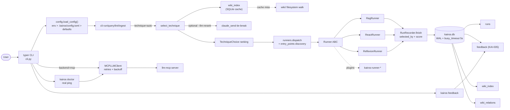

<div align="center">
  
  <h1>kairos</h1>
  <p><strong>Stop guessing. Run the right pattern.</strong></p>
  <p>A CLI for executable agent knowledge.</p>
  <p>
    <a href="https://pypi.org/project/kairos-agent/"></a>
    <a href="https://www.python.org/downloads/"></a>
    <a href="LICENSE"></a>
    <a href="https://github.com/vinothhacks/kairos/actions"></a>
  </p>
  <p>
    <a href="#install">Install</a> · <a href="#30-second-demo">Demo</a> · <a href="#whats-new-in-v03">What's new in v0.3</a> · <a href="#why-kairos">Why kairos</a> · <a href="#quickstart">Quickstart</a> · <a href="#how-it-works">How it works</a> · <a href="#commands">Commands</a> · <a href="#roadmap">Roadmap</a>
  </p>
</div>

---

## What's new in v0.3

**v0.3.0 closes the v3 audit scope: 5 KAI3 supply-chain/install findings plus 30 KAI2 carryovers.** Highlights:

- **Hardened release pipeline** - SHA-pinned actions, job-scoped publish permissions, and tag/version verification before PyPI publish.
- **Pinned installers** - one-liners default to `kairos-agent==0.3.0` with explicit override hooks.
- **Clean JSON output** - `kairos run --json` and `--json --dry` emit parseable JSON only.
- **Immediate wiki index** - `kairos init` seeds `wiki_index` so selector/query do not start cold.
- **Config parity** - `[wiki]`, `[selector]`, `[sources]`, BOM files, and case-insensitive backend values now work as documented.
- **Safer plugins** - third-party runner entry points require opt-in or allow-listing before import.
- **Run history** - `kairos history` and `kairos feedback-list` expose stored runs and feedback.

Full migration notes: [`docs/UPGRADING.md`](docs/UPGRADING.md). Existing v0.2 wikis upgrade in place.

## Install

```bash
pip install kairos-agent
```

That's it. Zero API keys. Every model call routes through [llm-mcp](https://github.com/vinothhacks/llm-mcp) so you reuse your existing ChatGPT and Claude sessions.

```bash
# or, with uv
uv tool install kairos-agent
```

```powershell
# Windows
irm https://raw.githubusercontent.com/vinothhacks/kairos/v0.3.0/install.ps1 | iex
```

```bash
# macOS / Linux
curl -fsSL https://raw.githubusercontent.com/vinothhacks/kairos/v0.3.0/install.sh | sh
```

## 30-second demo

```bash
$ kairos init my-wiki && cd my-wiki

$ kairos run "Search the docs for caching and summarize" --dry
   top-3 techniques for: Search the docs for caching...
   ┌──────┬───────────┬───────┬──────────────────────────────────┐
   │ rank │ technique │ score │ rationale                        │
   ├──────┼───────────┼───────┼──────────────────────────────────┤
   │ 1    │ rag       │ 0.70  │ keyword boost 0.50, overlap x4   │
   │ 2    │ react     │ 0.65  │ keyword boost 0.50, overlap x3   │
   │ 3    │ reflexion │ 0.05  │ overlap x1                       │
   └──────┴───────────┴───────┴──────────────────────────────────┘
```

`kairos` looks at your task, queries its wiki of agent techniques, and tells you which pattern to run: RAG, ReAct, or Reflexion. Then it actually runs it.

## Why kairos

You've read the LLM techniques. CoT, ReAct, Reflexion, ToT, HyDE, rerank — twenty patterns each with a paper, each with a use case, each easy to forget the morning you're three coffees into a real problem.

Most "LLM wikis" turn this into a static reading list. **kairos turns it into a runtime decision.** The wiki *is* the agent's playbook:

- **Ingest** raw sources (papers, transcripts, your own notes) → LLM-curated wiki pages.
- **Query** the wiki with natural language; answers cite real pages with `[[wikilinks]]`.
- **Lint** for contradictions, stale claims, and gaps. The wiki gets smarter with every run.
- **Run** any task — kairos picks the right technique by reading its own wiki, then executes it.

Three patterns ship with working runners (RAG, ReAct, Reflexion). The other 18 are documented and ready to be promoted from doc-only to runnable. **You can extend it.**

## Quickstart

```bash
# 1. Bootstrap a project. Copies 21 seed concept pages.
kairos init my-wiki && cd my-wiki

# 2. Ingest a source.
kairos ingest research/karpathy-llm-wiki-gist.md

# 3. Ask a grounded question.
kairos query "When should I use ReAct over RAG?"

# 4. Lint the wiki.
kairos lint

# 5. Run a task — kairos auto-selects the technique.
kairos run "Search the docs for caching, then summarize"

# 6. Or pick the technique manually.
kairos run "Iteratively refine this paragraph" --technique reflexion
```

Every run logs to `.kairos/kairos.db` (SQLite). Every page lives in plain markdown. Every wikilink survives `git diff`.

## How it works



Three layers, mirroring [Karpathy's LLM Wiki gist](https://gist.github.com/karpathy):

1. **`raw/`** - your immutable inputs (papers, articles, transcripts). Source of truth.
2. **`wiki/`** - LLM-generated, human-curated markdown pages. Lives in git.
3. **`AGENTS.md`** - the schema. Tells future LLM passes how the structure works.

See [`docs/architecture.md`](docs/architecture.md) for the full diagram.

## Commands

| Command | What it does |
|---|---|
| `kairos init [path]` | Bootstrap `AGENTS.md`, `raw/`, `wiki/`, `outputs/`. Seeds 21 concept pages. |
| `kairos ingest <file>` | Read a source, propose new + updated wiki pages, log the diff. |
| `kairos query "<q>"` | Lexically retrieve pages, ask the LLM to synthesize, cite wikilinks. |
| `kairos lint` | Local: orphans, missing concepts, stale pages. LLM: contradictions, gaps. |
| `kairos run "<task>"` | Auto-select technique, dispatch runner, log the run. |
| `kairos run "<task>" --dry` | Show the top-3 candidate techniques without running. |
| `kairos history` | List recent runs from `.kairos/kairos.db`. |
| `kairos feedback-list` | List saved feedback rows. |
| `kairos doctor` | Print env diagnostics. |
| `kairos version` | Print version. |

## What ships in v0.1

| | Count | Status |
|---|---|---|
| Concept pages (seed wiki) | 21 | doc-only |
| Runner-backed techniques | 3 | RAG, ReAct, Reflexion |
| Unit tests | 48 | green |
| Backends | 1 | SQLite (Postgres optional) |
| LLM bridge | 1 | `llm-mcp` (no API keys) |

The 21 seed concept pages: rag, react, reflexion, chain-of-thought, tree-of-thoughts, self-consistency, self-refine, constitutional-ai, plan-and-execute, few-shot-prompting, zero-shot-prompting, function-calling, tool-use, prompt-injection, embedding-search, hybrid-search, hyde, rerank, router-agent, memory-buffer, llm-wiki.

## Compared to

| | kairos | LLM-wiki gist | Notion AI | Obsidian + plugins |
|---|---|---|---|---|
| Plain markdown source | yes | yes | no | yes |
| Diff-able in git | yes | yes | no | yes |
| Ingest sources via LLM | yes | yes | partial | with plugins |
| Lint for contradictions | **yes** | manual | no | no |
| Pick technique automatically | **yes** | no | no | no |
| Execute the technique | **yes** | no | no | no |
| Zero API keys (uses MCP) | **yes** | no | no | no |
| CLI-first | yes | no | no | no |

The wedge: **executable wiki, not passive notes.**

## Configuration

```bash
# Where kairos finds llm-mcp (default: localhost:8765)
export KAIROS_MCP_URL="http://localhost:8765"

# Use a stub LLM client for offline tests
export KAIROS_LLM_BACKEND="stub"
```

Per-project config lives in `.kairos/config.toml`. Run `kairos doctor` to see resolved values.

## Roadmap

- **v0.1** *(now)* — 21 seed pages, 3 runners, SQLite logging, MCP bridge.
- **v0.2** — `--fix` for lint, technique outcome scoring (the selector learns from past runs), 5 more runners.
- **v0.3** — Composite techniques (Reflexion-over-ReAct, ToT-with-retrieval), Postgres backend, multi-user wikis.
- **v1.0** — Plugin runners (`pip install kairos-runner-tot`), web preview server.

See `CHANGELOG.md` for what landed in each release.

## Contributing

Found a wiki page that's wrong? Want a new technique runner? PRs welcome. Read `CONTRIBUTING.md` first.

```bash
git clone https://github.com/vinothhacks/kairos
cd kairos
uv pip install -e ".[dev]"
uv run pytest
```

## License

[MIT](LICENSE) © vinothhacks

## Acknowledgements

The wiki pattern is straight out of [Andrej Karpathy's LLM Wiki gist](https://gist.github.com/karpathy). The README structure follows [jcode](https://github.com/1jehuang/jcode) for the install-first / demo-first style. The technique catalog stands on the shoulders of every paper cited in the seed pages.
