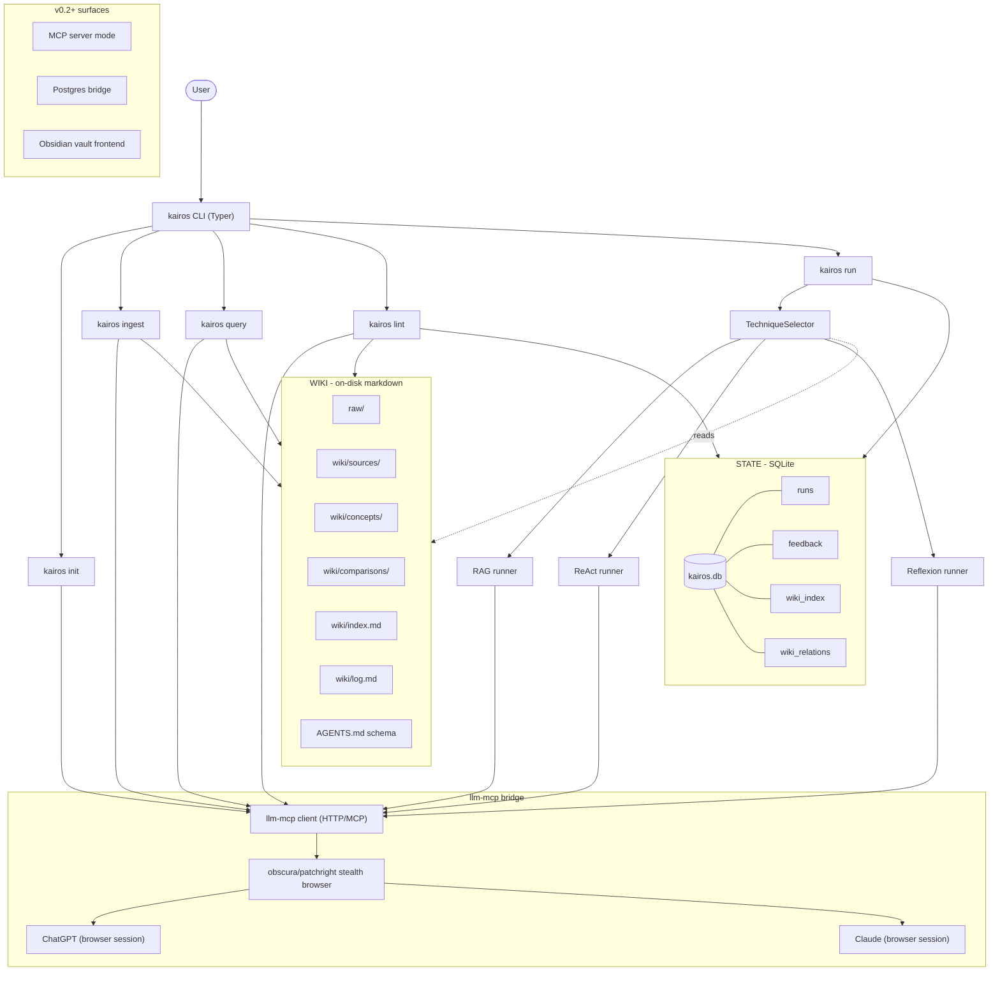
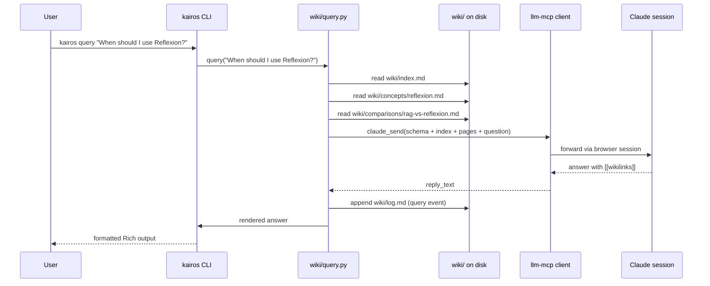

# Kairos v0.1 Architecture

## High-level flow



## Components

### CLI layer (`src/kairos/cli.py`)

- Built on **Typer** (declarative subcommands, auto `--help`, Rich integration).
- Subcommands: `init`, `ingest`, `query`, `lint`, `run`, plus housekeeping `version` and `doctor`.
- All output styled via **Rich**: tables, syntax highlighting for the wiki paths it touched, progress bars for ingest fan-out.

### Wiki ops layer (`src/kairos/wiki/`)

- `schema.py` — load and validate `AGENTS.md` (single source of truth for page templates, frontmatter contract, naming rules, workflows).
- `ingest.py` — read source from `raw/`, send to `claude_send` with `AGENTS.md` as system prompt, parse the LLM's edit plan, write to `wiki/sources/<slug>.md` + cascade updates to `wiki/concepts/`, append `wiki/log.md`, refresh `wiki/index.md`.
- `query.py` — read `index.md`, gather candidate pages, send to `claude_send`, parse answer with `[[wikilinks]]` citations, optionally save back to `wiki/`.
- `lint.py` — scan all `wiki/*.md` pages, send to `claude_send` for analysis, write `outputs/lint-YYYY-MM-DD.md`.

### Selector (`src/kairos/selector.py`)

- Reads `wiki/index.md` to enumerate every concept page.
- Sends the user task plus the index + brief summaries to `claude_send` for a ranked recommendation.
- Returns top-3 techniques with confidence scores; auto-runs top-1 unless `--dry`, `--technique <name>`, or no runner is registered.

### Runners (`src/kairos/runners/`)

- `base.py` — abstract `Runner` with `name`, `applicable(task) -> bool`, `run(task, context) -> Result`.
- `rag.py` — chunked retrieval over `--source-folder` (or `raw/` by default), context build, single `chatgpt_send` call.
- `react.py` — Thought / Action / Observation loop, k <= 6 steps, available tools: `claude_search_web`, local `read_file`, sandboxed `shell_run`.
- `reflexion.py` — initial answer (`chatgpt_send`) -> self-critique (`claude_send`) -> revised answer (`chatgpt_send`).

### llm-mcp client (`src/kairos/llm/mcp_client.py`)

- Talks to the running `llm-mcp` server (default `http://localhost:8765` or stdio).
- Wraps the 22+ tools we already have: `chatgpt_send`, `claude_send`, `chatgpt_search_web`, `claude_search_web`, `chatgpt_image_create`, `claude_diagram_create`, `chatgpt_research_*`, `claude_research_*`, etc.
- Auto-creates a fresh chat per task to avoid stale conversation context.
- Retries with exponential backoff on UI flake; surfaces clear errors when sessions expire.

### Memory layer (`src/kairos/memory/`)

- `kairos.db` — SQLite by default, lives at `~/.kairos/kairos.db`.
- Optional Postgres bridge (off in v0.1; `KAIROS_DB_URL=postgresql://...` activates it).

### Config (`~/.kairos/config.toml`)

```toml
[kairos]
default_technique = "auto"
max_react_steps = 6
runner_timeout_s = 120
mcp_url = "http://localhost:8765"

[wiki]
auto_save_query_answers = false
lint_on_ingest = true

[runners.rag]
chunk_size = 800
top_k = 6
```

## On-disk layout (after `kairos init`)

```
my-project/
├── AGENTS.md              <-- the schema (Karpathy CLAUDE.md equivalent)
├── raw/                   <-- user-curated immutable sources
│   ├── articles/
│   ├── papers/
│   └── ...
├── wiki/                  <-- LLM-generated, LLM-maintained
│   ├── index.md
│   ├── log.md
│   ├── concepts/
│   ├── sources/
│   └── comparisons/
├── outputs/               <-- lint reports, run transcripts
└── .kairos/
    └── kairos.db          <-- per-project state (sqlite)
```

The package itself ships a **seed wiki** at `<package>/_seed/` containing the 20 agent-technique concept pages (RAG, ReAct, Reflexion, ToT, etc.). `kairos init` copies the seed wiki into the user's `wiki/` if `wiki/` doesn't exist.

## Data flow (end-to-end query)



## Why this shape

- **Files are the source of truth.** `wiki/` survives database loss; `kairos.db` is purely state, not knowledge.
- **`AGENTS.md` is sacred.** Both the package and the user's project-local copy follow the same schema; Karpathy's pattern works only if the schema is honored.
- **Single LLM bridge.** All techniques use the same `llm-mcp` client. New runners do not introduce new auth code paths.
- **Selector reads, runners write.** The selector touches no LLM session for selection itself in v0.1 (rule-based heuristics over `wiki/index.md` for speed). v0.2 may switch to model-first selection.

> Update Phase 4: pre-implementation review revised the v0.1 selector to **rule-based** heuristics (string-overlap + tag match) so it stays free of model calls and can be tested fully without the network. The model-based variant is parked for v0.2.

## Failure model

| Failure | Behavior |
|---|---|
| `llm-mcp` server not running | `kairos doctor` exits with clear message; commands that need an LLM exit non-zero with `MCP_UNREACHABLE`. |
| ChatGPT or Claude session expired | `mcp_client` surfaces the provider's `logged_in=false`; CLI tells user how to re-login through `llm-mcp`. |
| Wiki page parse fails | Skip the page, log warning, continue. Lint will flag it next run. |
| `AGENTS.md` invalid | Hard error on `kairos init` / first command; never operate without a valid schema. |
| Runner timeout | Returns a partial result with `status="timeout"`, logged to `runs` table; user can re-run with `--no-timeout`. |

## Diagrams in `docs/`

- `architecture.md` (this file)
- `docs/decisions/0001-tech-stack.md`
- `docs/decisions/0002-data-model.md`
- `docs/memory.md` (v0.2)
- `docs/technique-protocol.md` (v0.2)
