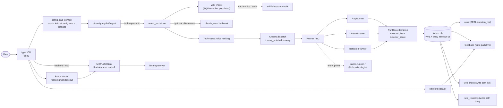
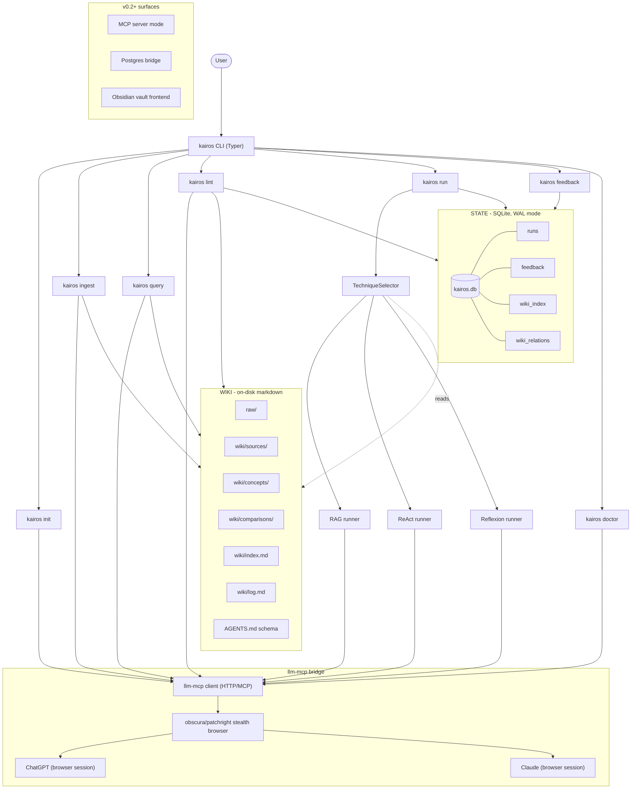
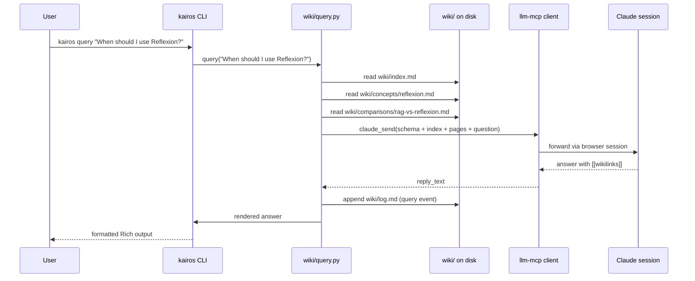

# Kairos v0.2 Architecture

> Updated for the v0.2 audit-fix release (2026-05-11). The flow below matches what the code actually does. Aspirational items live under `## v0.3+ surfaces`.

## High-level flow



> See `architecture.md` (this file) for the canonical mermaid; the same diagram is mirrored in [`README.md`](../README.md#how-it-works) so first-time readers see the same picture.

## Subsystems



## Components

### CLI layer (`src/kairos/cli.py`)

- Built on **Typer** (declarative subcommands, auto `--help`, Rich integration).
- Subcommands: `init`, `ingest`, `query`, `lint`, `run`, `feedback`, `doctor`, `version`.
- All output styled via **Rich**: tables, syntax highlighting for the wiki paths it touched, progress bars for ingest fan-out.
- v0.2 (KAI-007) renders LLM replies with `markup=False` so `[[wikilinks]]` survive Rich's bracket parser intact.

### Wiki ops layer (`src/kairos/wiki/`)

- `schema.py` — load and validate `AGENTS.md` (single source of truth for page templates, frontmatter contract, naming rules, workflows).
- `ingest.py` — read source from `raw/`, send to `claude_send` with `AGENTS.md` as system prompt, parse the LLM's edit plan, write to `wiki/sources/<slug>.md` + cascade updates to `wiki/concepts/`, append `wiki/log.md`, refresh `wiki/index.md`.
- `query.py` — read `index.md`, gather candidate pages, send to `claude_send`, parse answer with `[[wikilinks]]` citations, optionally save back to `wiki/`.
- `lint.py` — scan all `wiki/*.md` pages, send to `claude_send` for analysis, write `outputs/lint-YYYY-MM-DD.md`.

### Selector (`src/kairos/selector.py`)

- Reads `wiki_index` SQLite cache first (KAI-021); falls back to a filesystem walk when the cache is empty or stale.
- Rule-based ranking: keyword boosts + segment-match against page slug (KAI-028) + body lexical overlap.
- Top-3 ranking, with a top-N tie-break that promotes the safe default (`rag`) when scores cluster within 0.05 (KAI-029).
- Optional `--llm-rerank` flag (KAI-020): when on and the top-3 are close, calls `claude_send` for a tie-break.
- Always returns at least one `TechniqueChoice`; auto-runs top-1 unless `--dry`, `--technique <name>`, or no runner is registered.

### Runners (`src/kairos/runners/`)

- `base.py` - abstract `Runner` with `name`, `applicable(task) -> bool`, `run(task, ctx) -> RunResult` (KAI-006).
- `__init__.py` - dispatches by name and discovers third-party runners via `entry_points(group="kairos.runners")`.
- `rag.py` - chunked retrieval over `--source-folder` (or `raw/` by default), 5MB per-file cap (KAI-044), single `chatgpt_send` call.
- `react.py` - Thought / Action / Observation loop, k <= 6 steps, tools: `search_web`, `read_file`, `finish` (KAI-019).
- `reflexion.py` - initial answer (`chatgpt_send`) -> self-critique (`claude_send`) -> revised answer (`chatgpt_send`).
- `RunResult` no longer carries `trace` in memory (KAI-034); the JSONL trace is on disk at `outputs/run-NNNNN/trace.jsonl`. Use `kairos run --json` to inline it.

### llm-mcp client (`src/kairos/llm/mcp_client.py`)

- Talks to the running `llm-mcp` server (default `http://localhost:8765` or stdio).
- Wraps the 22+ tools we already have: `chatgpt_send`, `claude_send`, `chatgpt_search_web`, `claude_search_web`, `chatgpt_image_create`, `claude_diagram_create`, `chatgpt_research_*`, `claude_research_*`, etc.
- Auto-creates a fresh chat per task to avoid stale conversation context.
- v0.2 (KAI-017): up to 3 attempts with exponential backoff (0.5s base + jitter) for 5xx + connect errors. 4xx is **never** retried.
- v0.2 (KAI-015): integration tests inject an `httpx.MockTransport` via the `_transport` attribute - no network needed.
- v0.2 (KAI-026): `StubLLMClient` default reply is generic, never echoes the prompt, so tests can't accidentally leak content via the stub path.

### Memory layer (`src/kairos/memory/`)

- `kairos.db` - SQLite, lives at `<project>/.kairos/kairos.db` by default.
- Override with `KAIROS_DB_HOME=/some/path` (KAI-018); v0.3 namespaces the file under a short project hash at `${KAIROS_DB_HOME}/<project_hash>/kairos.db` so shared homes do not mix unrelated projects.
- Opens with `journal_mode=WAL`, `synchronous=NORMAL`, `busy_timeout=5000` (KAI-022) so concurrent runs don't trample each other.
- `wiki_index` and `wiki_relations` are populated by `WikiIndexer` (KAI-005) on init, ingest, lint, and save-to-wiki query; selector + query consume them.
- `feedback` table receives writes from `kairos feedback <run-id> --rating 1..5 --note "..."` (KAI-035).
- Postgres support is **deferred to v0.3** (KAI-036). The `[postgres]` extra is gone from `pyproject.toml`.

### Config (`<project>/.kairos/config.toml`)

```toml
[llm]
backend = "mcp"             # "stub" or "mcp"
mcp_url = "http://localhost:8765"

[wiki]
stale_after_days = 180
auto_save_query_answers = false

[selector]
default_technique = "rag"
require_runner = true

[sources]
# free-form key/value map; surfaces in `kairos doctor`.
my_papers = "/Users/me/papers"
```

`load_config()` merges in this order: **environment variables** (`KAIROS_*`) > **`.kairos/config.toml`** > **built-in defaults**. `kairos doctor` shows which file (if any) was read and what the resolved values are.

## On-disk layout (after `kairos init`)

```
my-project/
├── AGENTS.md              <-- the schema (Karpathy CLAUDE.md equivalent)
├── raw/                   <-- user-curated immutable sources
│   ├── articles/
│   ├── papers/
│   └── ...
├── wiki/                  <-- LLM-generated, LLM-maintained
│   ├── index.md
│   ├── log.md
│   ├── concepts/
│   ├── sources/
│   └── comparisons/
├── outputs/               <-- lint reports, run transcripts
└── .kairos/
    └── kairos.db          <-- per-project state (sqlite)
```

The package itself ships a **seed wiki** at `<package>/_seed/` containing the 21 agent-technique concept pages (RAG, ReAct, Reflexion, ToT, etc.). `kairos init` copies the seed wiki into the user's `wiki/` if `wiki/` doesn't exist.

## Data flow (end-to-end query)



## Why this shape

- **Files are the source of truth.** `wiki/` survives database loss; `kairos.db` is purely state, not knowledge.
- **`AGENTS.md` is sacred.** Both the package and the user's project-local copy follow the same schema; Karpathy's pattern works only if the schema is honored.
- **Single LLM bridge.** All techniques use the same `llm-mcp` client. New runners do not introduce new auth code paths.
- **Selector reads, runners write.** v0.2 selector stays rule-based by default (deterministic, network-free, fully testable) and only escalates to `claude_send` when `--llm-rerank` is set AND the top candidates are within 0.05 of each other.

## v0.3+ surfaces

Items deferred until a future release. They are intentionally out of scope for v0.2 and not implemented:

- **Postgres backend.** `[postgres]` extra removed (KAI-036). Will return as a proper bridge once the multi-tenant wiki design lands.
- **Embedding-based retrieval.** v0.2 RAG is purely lexical. Embeddings will arrive when `llm-mcp` exposes a vector tool.
- **Webhook publishing.** `kairos publish github|linkedin` is described in some doc copy but not implemented; planned for v0.3.
- **`kairos lint --fix`.** The flag exists for compatibility; it is a no-op in v0.2.
- **Model-first selection.** Default stays rule-based for speed and offline use. The optional `--llm-rerank` is the v0.2 compromise.

## Failure model

| Failure | Behavior |
|---|---|
| `llm-mcp` server not running | `kairos doctor` exits with clear message; commands that need an LLM exit non-zero with `MCP_UNREACHABLE`. |
| ChatGPT or Claude session expired | `mcp_client` surfaces the provider's `logged_in=false`; CLI tells user how to re-login through `llm-mcp`. |
| Wiki page parse fails | Skip the page, log warning, continue. Lint will flag it next run. |
| `AGENTS.md` invalid | Hard error on `kairos init` / first command; never operate without a valid schema. |
| Runner timeout | Returns a partial result with `status="timeout"`, logged to `runs` table; user can re-run with `--no-timeout`. |

## Diagrams in `docs/`

- `architecture.md` (this file)
- `docs/decisions/0001-tech-stack.md`
- `docs/decisions/0002-data-model.md`
- `docs/memory.md` (v0.2)
- `docs/technique-protocol.md` (v0.2)
